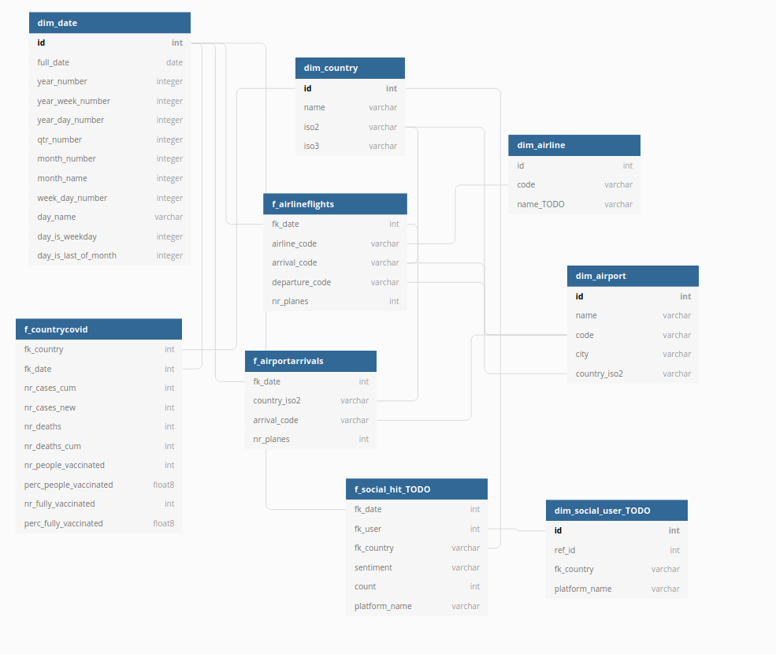

## Scope  
This is the capstone project for the Data Engineering Nanodegree.  

In this project I built a data pipeline to gather data from worldwide flights and COVID cases per territory, to understand the spread of the disease and its impact in our mobility. Additionally, the development of vaccines brings hope for the near future. The present work also includes data on vaccination, which will help track and evaluate the effects in terms of prevalence of cases, as well as the rebound of aviation and the travel industry.   

This theme was chosen for its recency and the academic interest and challenge it presents, due to the high cardinality provided by flights data.  

## Technologies  
Airflow, AWS EMR, Spark, AWS S3, Python, Pandas, SQL, ETL, Bash, Big Data, Data Lake, Data Warehousing,   

## Data Pipeline  
The data pipeline consists of roughly 4 phases :  
1. Process Metadata and raw data files acquisition  
2. Raw data preprocessing and load to staging - locally and to S3 using EMR  
3. Dimensional model transformation and Load  
4. Data validation and counts  

For more detail, please consult `docs/2.0 data_pipeline.md` file.  

## Data Model  
We followed a simple Star Schema approach, described on `docs/1.0 data_model.md`, in which the following tables were considered:  

Dimensions: Country, Airport , Airline, Date  

Facts: Airport Arrivals, Airline Flights , COVID per Country  

Tables marked as TODO were initially considered, but out of scope for this delivery. Still, I argue that it would be interesting to have a social media study, with setiment analysis and keyword evaluation for the future.     

  

Please consult `docs/0. presentation_an_motivation.md` for more information on the project's motivation, sources and thought use cases.  

## Future work  
Additional sources can be included, leveraging the existing pipeline. One suggestion, already presented, is the inclusion of a social thermometer through Tweets. One interesting exercice could potentially be to employ sentiment analysis, geographical distribution and evolution comparison with COVID prevalence.  
Including macroeconomic indicators, such as GDP, could also be interesting to evaluate the effect of COVID on each economy. This is a more traditional exercise, that I did not consider.  

## Examples  

In this work, some example charts generated with the model data are presented in `docs/5. examples.md` .  
Please check these out for some simple example charts, generated using Google Data Studio.  

  