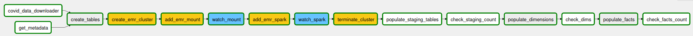

## Data Pipeline  

The data pipeline consists roughly of four general phases in our ETL process, which are subdivided into the following tasks in our dag :  
1. Getting the raw data / files from selected sources tasks:  
-__covid_data_downloader__: get data from Library, JSON and CSV formats through GET requests, and store in S3 bucket, in CSV format. Low to medium cardinality  
-__get_metadata__: fetch metadata for Zenodo repository downloads and store it in S3 bucket for later download. Information stored as individual download URLs.  
Upload etl files necessary for Spark process on EMR instances  

2. Processing the raw data into staging tables, encompasses the following tasks:  
-__create_tables__: processes all SQL create statements which handles table cretion for Staging and Dimensional model in Redshift (analytical) database  
-__create_emr_cluster__: leveraging AWS airflow connection and operators, create an AWS EMR instance, according to given configurations  
-__add_emr_steps__: adds steps for high cardinality data download and processing, encompassing __(1) shell script step__ > Mounts s3 as file system and downloads files using wget and metadata files generated in step 1, and __(2) spark step__ > performs spark transformation, using etl process uploaded to S3 on first phase. Writes Spark resulting files to __S3 parquet__ files   
-__watch_step__: waits for EMR steps to finish  
-__terminate_cluster__: terminates EMR cluster after steps processed, to avoid further costs  

3. Transforming the staging data into dimensional model (conformed dimensions and facts)   
-__populate_staging_tables__: performs a copy of raw data files (CSV and parquet) stored in S3 to corresponding staging tables  
-__populate_dimensions__: populates conformed dimension tables, with data provided from staging tables, performing the necessary attribute selects and joins to enrich data    
-__populate_facts__: populates fact tables, performing the necessary transformations to aggregate to desired granularity and joins to enrich data. Enforces business rules, such as _airport code not null_ for flight arrivals fact table   
4. Data validations;  
-__check_staging_count__: performs count on staging tables, enforcing a greater than 0 count and returning total nr rows, before proceeding to dimension tables  
-__check_facts_count__: performs count on fact tables, enforcing a greater than 0 count and returning total nr rows  

#### Discussion on phase 2  
The present process __creates__ an EMR cluster and installs dependencies needed for the download of our data via shell script each time the ETL is run, due to the necessity of flexibility in the scope of this project. We need to reproduce the same effect each time we run it on different machines, without having too much overhead. Spinning an EMR cluster and installing dependencies is a great way to have on-demand processing capacity, without having permanent dedicated instances running, such EC2.  
Having S3 mounted on EMR, also provides the capability of easily downloading data into S3, that remains after we run our Spark process and kill our EMR.  
A better solution would have a permanent instance running, which however is not possible in our present context.  
